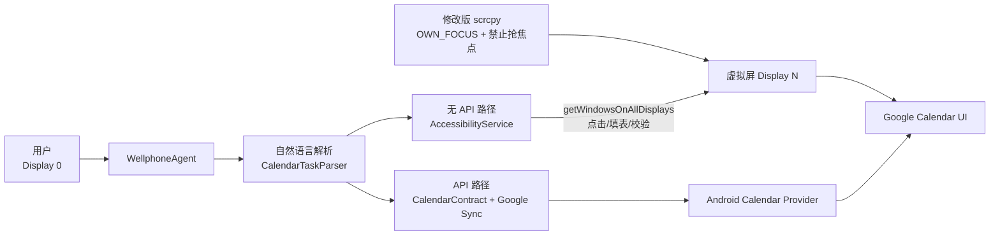

# WellphoneAgent

Android 15 上的双路径日历 Agent：API 路径在后台写入日历；无 Calendar API 路径在 scrcpy 隔离虚拟屏中操作 Google Calendar。用户可继续使用主屏 `Display 0`，不被抢占画面、键盘或顶层焦点。

## 架构



- **API 路径**：写入事件和提醒，持续等待 Google Calendar 同步成功。
- **无 Calendar API 路径**：不调用 `CalendarContract` 写入，在虚拟屏自动完成“新建事件 → 标题 → 开始/结束日期时间 → 保存”。
- `patches/scrcpy-focus-isolation.patch` 移除不稳定的 display-group flags，并启用 `STEAL_TOP_FOCUS_DISABLED`。

## 技术选型

- **scrcpy VirtualDisplay**：复用成熟的显示创建与画面传输能力；修改 server flags，实现主屏与虚拟屏焦点隔离。
- **AccessibilityService**：通过 `getWindowsOnAllDisplays()` 定位虚拟屏控件并点击、填表，不使用 scrcpy 控制通道或系统输入法。
- **CalendarContract + requestSync**：提供可靠的后台 API 基线，并与纯 UI 自动化路径对照。
- **Kotlin + 本地规则解析**：在端侧解析“今天/明天/后天、时间、提前提醒”，无需后端、LLM 或密钥。

## 部署

要求：Windows 11、JDK 17、Android SDK Platform 37/ADB、scrcpy 4.1，以及 Android 15（API 35+）模拟器或设备；Google Calendar 已安装并登录。

```powershell
# 1. 构建并安装 App
.\gradlew.bat :app:testDebugUnitTest :app:installDebug

# 2. 在项目目录内构建修改版 scrcpy server
git clone --branch v4.1 --depth 1 https://github.com/Genymobile/scrcpy.git tools/scrcpy
git -C tools/scrcpy apply ../../patches/scrcpy-focus-isolation.patch
.\tools\scrcpy\gradlew.bat -p tools\scrcpy\server assembleRelease

# 3. 启动不带控制通道的隔离虚拟屏
$env:SCRCPY_SERVER_PATH="$PWD\tools\scrcpy\server\build\outputs\apk\release\server-release-unsigned.apk"
scrcpy -s emulator-5554 --new-display=720x1280/320 --no-audio --no-control --no-vd-system-decorations
```

打开 WellphoneAgent，启用 **Agent Accessibility**，刷新并选择最新的虚拟屏；随后可选择“创建日历提醒”（API）或“不用 API 创建另一个日历”（虚拟屏 UI）。首次使用 API 路径需授予日历读写权限。

## 环境变量

- `JAVA_HOME`：JDK 17 路径
- `ANDROID_SDK_ROOT`：Android SDK 路径
- `SCRCPY_SERVER_PATH`：修改版 scrcpy server APK 路径

无需 API Key、云端密钥或 `.env` 文件。
